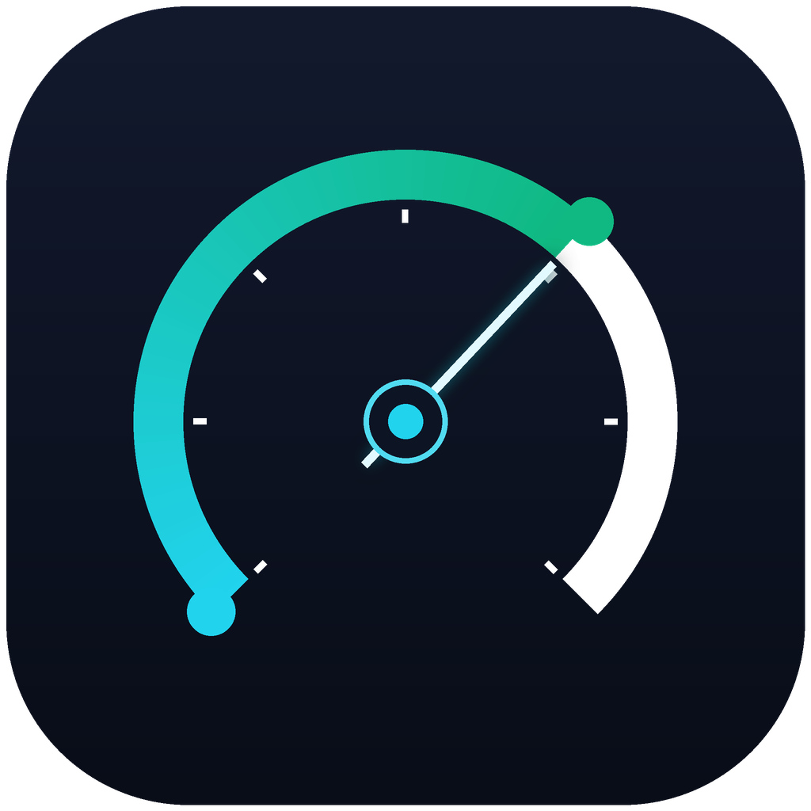

# ZCode 速度仪表盘（zcode-speed-panel）

[](LICENSE)
[](https://github.com/Masterchiefm/zcode-speed-panel/actions/workflows/build.yml)

一个 Tauri 2 + Rust 的桌面常驻小工具：实时展示 ZCode CLI 的模型输出速度与今日 Token 用量，支持桌宠、迷你仪表盘与速度胶囊三种悬浮窗形态，可最小化到系统托盘。

<p></p>

**[⬇ 下载最新版 Release](https://github.com/Masterchiefm/zcode-speed-panel/releases/latest)** —— Windows 安装包（NSIS）由 GitHub Actions 自动构建；推送 `v*` 标签即自动发布新版，任意提交的构建产物也可在 [Actions](https://github.com/Masterchiefm/zcode-speed-panel/actions) 页下载（Artifacts）。

## 功能

- **悬浮窗模式**（点右上角高亮的"⧉ 收起为悬浮窗"，或直接点窗口关闭按钮）
  - 三种样式可选（完整面板右上角下拉框）：**桌宠**（默认鲸鱼女仆，200×200；**滚轮上下滚动缩放** 100~480；双击或 🔄 换宠物；生成中跑步、待机站立，头顶气泡只显示实时速度）/ **迷你仪表盘**（116×116）/ **速度胶囊**（224×78）
  - 按住任意位置拖动；点 ⤢ 或**右键菜单 → 恢复窗体**展开回完整面板；右键菜单还可**退出程序**
  - 桌宠位置与完整面板位置**各自独立记忆**：收起时桌宠回到自己上次的位置（首次锚定窗体中心），展开时窗体回到自己的老位置，互不拉扯
  - 模式、样式、两种位置与桌宠尺寸都会记住，下次启动直接恢复
- **近 15 分钟速度曲线**（10 秒一档；横轴标注**真实墙钟时刻**，每 5 分钟一条刻度，整条曲线随时间连续左移，可直接对表验证）
- **窗口/托盘**：标题栏实时显示当前速度；**点窗口关闭按钮 = 收起为悬浮窗**（不再藏进托盘）；托盘左键单击显示/隐藏；右键菜单（显示面板 / 隐藏到托盘 / 悬浮窗切换 / 退出）；重复启动自动唤起已有窗口
- 状态栏：数据源（usage 数据库）、今日调用次数、会话数、最近活动时间

## 数据源

- **今日用量与平均速度**：只读轮询 ZCode usage 数据库（`~/.zcode/cli/db/db.sqlite` 的 `model_usage` 表，WAL 模式不影响运行中的客户端）。速率定义采用**纯生成时长**：分母 = `completed_at - first_token_at`（排除首 token 等待与排队），分子 = `output_tokens + reasoning_tokens`（思考内容同样是流式输出）。一张表覆盖全部会话（含子 agent）。
- **实时速度（30s 滑窗实测，秒级启停）**：不依赖落盘数据，直接实测 CLI 进程的写字节流折算而成，原理见下方[《实时速度实测原理》](#实时速度实测原理)。
- 部分调用期间 UI 管道无增量字节（实测约半数调用是"完成时一次性刷出"），此时回退为：门控判定生成中 → 显示**近期已完成调们的真实速度 ≈**（与速度曲线同口径，两者不再打架）；完全无调用 → 归零待机。

## 实时速度实测原理

**要解决的问题**：ZCode 只在调用完成时才把 token 数落盘（`model_usage` 表），流式过程中数据库里没有任何增量数据——这是所有"完成后统计"类工具的共同盲区：长回答生成期间，速度只能显示 0 或上一次的旧值。

**关键观测**：CLI 进程在模型流式输出时，会持续把渲染增量写入通往桌面 UI 的管道。对进程写字节速率的实测显示：

| 状态 | 写速率（每 ~700ms 拍） |
|---|---|
| 流式输出中 | 6 ~ 25 KB，随生成节奏波动 |
| 待机 | 仅 1 ~ 2 KB 心跳 |
| 调用完成瞬间 | 数百 KB 尖峰（落盘写入） |

这个计数器由 Windows 内核维护（`GetProcessIoCounters` 的 `WriteTransferCount`），权威、实时、读取零开销。

**测量循环（随主轮询 ~700ms 一拍）**：

1. **发现进程**：Toolhelp32 枚举全部进程 → 过滤 `ZCode.exe` → 读每个进程的完整命令行（ProcessBasicInformation → PEB → ProcessParameters → CommandLine），只保留含 `zcode.cjs` 的 CLI 子进程（每 30s 刷新，排除桌面壳/渲染进程）
2. **采样**：对每个 CLI 进程读取 `WriteTransferCount`（进程启动以来累计写字节），存入每进程约 3 分钟的环形缓冲
3. **启停判定（调用门控）**：usage 库的调用行只在完成时落盘，但 message 表的 assistant 消息行在**调用开始瞬间**即提交（实测 ≤200ms 可读）——以"最新 assistant 消息创建时间 > 最新已完成调用的完成时间"判定"调用进行中"：开始当拍生效（首 token 前即显示"统计中"），完成行落盘当拍速度归零。工具执行/待机期间管道同样有 UI 状态突发，字节上无法与模型流式区分，门控将其可靠排除
4. **速度读数（30s 滑窗 ∩ 活跃段）**：对 30s 窗口内的清洗字节取均值，但左边界不早于本段流式起点——起步时只有几拍也立即有读数（状态栏显示"统计中…"），随后窗口逐渐填满变得平滑；流内停顿与完成瞬间的落盘尖峰不会混入
5. **扣心跳噪声**：每进程取自身历史最小增量的 2 倍作为底噪扣除（自适应，各进程底噪不同），**单拍封顶 ~2KB**——不封顶时持续流式期间分位数会被流式增量本身抬高，把自己的输出当噪声扣掉（实测读数塌缩到真值 1/5 的元凶之一）
6. **扣落盘尖峰（允许负拍）**：同步监测 rollout/日志/WAL 文件大小增量并从写字节中减去。落盘 flush 与 IO 计数存在错位：单拍可能"文件涨了 60KB 但只写了 20KB"，**该拍记为负值**，由前后正拍在区间总和中对消；若逐拍钳 0，错位增量会被永久吞掉（实测另一半损失来源）。单拍原始增量超过 100KB（请求体上传 ~190KB/拍）整拍剔除，字节与时长都不进积分
7. **字节 → token（一致性校准）**：除以**自校准系数**。每次调用完成后，用**与显示路径完全相同的清洗流**在 `[first_token, completed]` 区间的按时间比例积分字节 ÷ 真实 `output+reasoning tokens` 得到一次校准样本，取最近 5 个（含初始 600 先验）的中位数作为当前系数。**分子与显示分子同源**：任何系统性扣除（噪声底/落盘镜像/突发剔除）都被系数自动抵消，显示值收敛到真实 t/s。**输出 <300 token 的调用不入样本**——小调用的 UI 固定帧开销会把系数抬高数倍。先验样本保证冷启动时单个异常样本无法独占系数

**管道静默回退**：实测相当一部分调用（多为 `first_token_at` 为空者）生成期间不往 UI 管道写增量、全部字节在完成瞬间一次性刷出。对这类调用，门控（生成中）与字节（静默）组合判定后，面板回退显示"近期 10 分钟已完成调用的真实速度"（≈ 标记，与速度曲线完全同源），避免出现"图表 50、仪表盘 0"的矛盾。

**只看当前会话**：每次调用完成时，取流式区间内写字节最多的进程，标记为该会话所属的 CLI 进程；实时速度只统计"当前会话"（最近完成调用的会话）对应的那一个进程。后台 bot、其他窗口的流量被天然隔离，不会造成"已经停止了还显示生成中"。

**实测效果**（标题栏轨迹）：

```
19:56:54  ⏸ 0.0 t/s     ← 无任务
19:56:55  ▶ 18.2 t/s 统计中 ← 首字节出现，当拍响应、立即有读数（30s 滑窗建立中）
19:56:58  ▶ 37.5 t/s    ← 滑窗填满，读数趋于平滑
19:57:21  ▶ 9.5 t/s     ← 末段节奏放缓（真实反映）
19:57:22  ⏸ 0.0 t/s     ← 停止后 1~2 拍内判定停止，立即归零
```

**精度说明与对账**：字节 → token 的换算是统计近似的（清洗流实测约 200~900 B/token，随 UI 帧内容波动；一致性校准使其长期积分收敛到真值）。精确 token 计数仍由每次调用完成时的落盘记录提供，用于今日总量与均值——两者互为补充。每次调用完成后，调试日志写入一条对账事件：`pred_tps =` 清洗流区间积分 ÷ 生成时长 ÷ 当前系数，与落盘真值 `true_tps` 对比即可量化实时准确性：

```bash
python scripts/live_vs_true.py            # 实时 vs 真值 对账（旧格式日志自动退化 tick 回放）
```

- 今日 Token 总量与 ZCode 官方统计同口径 = `input + output + reasoning + cache_creation`；**缓存命中（cache_read）是提示复用、不计入总量**，明细中单独展示。按事件完成时间归属"今日"，跨天自动重置。

> 隐私：所有数据仅从本地文件与进程读取，不上传任何内容。

## 开发与构建

环境要求：Node.js ≥ 20、Rust stable（Windows 下需 MSVC 工具链）、WebView2 运行时（Win11 自带）。

```bash
npm install
npm run tauri dev      # 开发调试（debug 版连接 vite dev server）
npm run tauri build    # 正式版（内嵌前端 + NSIS 安装包）
```

产物位置：

- 可执行文件：`src-tauri/target/release/zcode-speed-panel.exe`
- 安装包：`src-tauri/target/release/bundle/nsis/*.exe`

调试工具（不走 UI，直接打印引擎对真实数据的计算结果，含 IO 实测可用性）：

```bash
cd src-tauri && cargo run --example dump
```

**调试日志**：面板运行时持续把三类数据追加到 `~/.zcode/speed-panel-debug.jsonl`（8MB 自动轮转保留一代，**轮转出的旧文件超过 7 天在启动时自动清理**）：`tick`（实时显示值/清洗管道字节率 `pipe`/生效系数/统计图尾桶，活跃期逐拍+待机心跳 30s 一条）、`call`（每轮调用完成后的真实 token 与真实速度）、`cal`（每次校准与对账：真值 `true_tps`、原始/清洗积分字节 `raw_kb`/`clean_kb`、样本系数 `bpt_sample`、显示口径预测 `pred_tps`）。离线验证工具同样记录这三类事件：

```bash
cd src-tauri && cargo run --example verify -- 300 target/verify-log.jsonl   # 采样 5 分钟
python scripts/compare3.py src-tauri/target/verify-log.jsonl                # 仪表盘 vs 统计图 vs 真值 三源对比
```

单元测试：

```bash
cd src-tauri && cargo test
```

### 自动构建与发布（GitHub Actions）

推送到 `main` 或提交 PR 会自动编译 Windows 安装包（产物在 [Actions](https://github.com/Masterchiefm/zcode-speed-panel/actions) 页的 Artifacts 里）；打 `v*` 标签（如 `git tag v0.2.0 && git push --tags`）会自动创建 [Release](https://github.com/Masterchiefm/zcode-speed-panel/releases) 并附上 NSIS 安装包。配置见 [`.github/workflows/build.yml`](.github/workflows/build.yml)。

## 浏览器预览

`npm run dev` 后直接在浏览器打开 <http://localhost:1420>，页面会以模拟数据运行（检测到非 Tauri 环境自动进入 mock 模式），便于调样式。

## 技术栈

Tauri 2（Rust 后端：usage 数据库轮询 + 进程 IO 实测 + 托盘）、原生 Canvas 绘制仪表盘与桌宠（无图表库依赖）、Vite + TypeScript。

## 致谢

- [zcode-tps-monitor](https://github.com/shy3130/zcode-tps-monitor)（MIT）：本项目速率定义借鉴其纯生成时长口径（first_token_at 起点、思考 token 计入分子）
- [dsh-desk](https://github.com/Renakoni/dsh-desk)（MIT）：桌宠采用其内置的 Codex Pet 宠物包（月薪喵、Maid-DeepSeek-Whale）

详见 [THIRD-PARTY-NOTICES.md](THIRD-PARTY-NOTICES.md)。

## 协议

[MIT](LICENSE)
